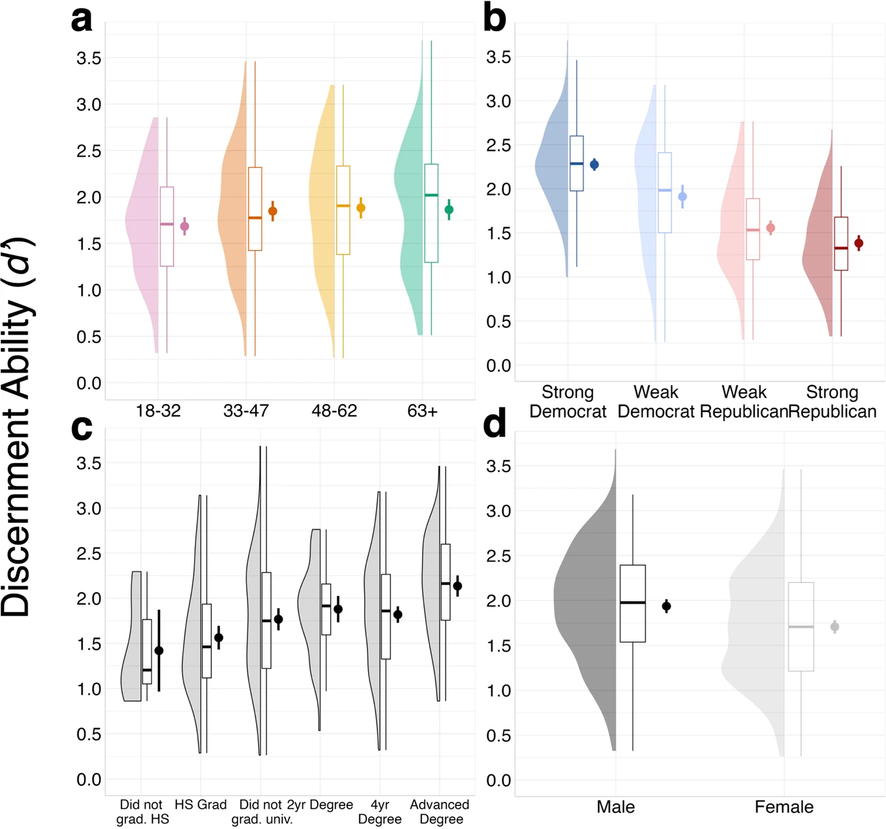

```{r setup, include=FALSE}
knitr::opts_chunk$set(echo = TRUE)
```

# Introduction

In this project, we're taking a close look at how well people from different political parties can tell fact from fiction, a skill known as "discernment ability". **Discernment ability** is described as the capacity to make intelligent judgments and distinguish between items, such as true and false statements, even when they closely resemble each other.

This analysis draws inspiration from Dobbs et al.'s 2023 study, which took place in the United States and shed light on some intriguing differences between Democrats and Republicans in identifying the truth. Furthermore, all the information presented in this document is supported by data that has been carefully cleaned and organised, with technical specifics documented in the codebook section.

The purpose of this project is to replicate Figure 1b from the original paper. Using the raw data provided by Dobbs and his team, as well as my own processing techniques, the aim is to recreate the exact figure as presented in their paper. By replicating their findings, I seek to assess the reproducibility and validity of the original result.

By the end of this project, not only will detailed charts be showcased, but insights into the relationship between political parties and perception will also be provided.

## Main Reference

This plot replicates Figure 1b from Dobbs et al. (2023), which illustrates differences in discerning true and false news between Democrats and Republicans, highlighting Democrats' superior performance in judgment. In their study, they recruited 533 participants using Prolific, who had equal numbers of Democrats and Republicans, and rated 140 fact and misinformation items in a randomized order.

**Full reference:** Dobbs, M., DeGutis, J., Morales, J., Joseph, K., & Swire-Thompson, B. (2023). Democrats are better than Republicans at discerning true and false news but do not have better metacognitive awareness. Communications Psychology, 1(1), 46.

**Link:** <https://www.nature.com/articles/s44271-023-00040-x>

## Original figure

{width="500"}

# Research Question

The research question for this project is "Are Democrats better than Republicans at discerning true and false news?". This question is answered in the visualisation and interpretation sections of this project.

# Codebook

| Variable Names         | Definitions of Code Variables                                                                                                                                                    |
|--------------------------|----------------------------------------------|
| **packages**           | A vector of package names required for the analyses. This includes 'tidyverse', 'ggplot2', 'gghalves', 'ggdist', 'see'.                                                          |
| **raw_data_path**      | The file path to the raw data CSV file.                                                                                                                                          |
| **data**               | The dataset loaded from the raw data CSV file.                                                                                                                                   |
| **processed_data**     | The dataset after cleaning and filtering.                                                                                                                                        |
| **processed_data_dir** | The directory path where the cleaned and processed data CSV file is saved.                                                                                                       |
| **stats**              | Summary statistics including mean, standard deviation, sample size, standard error, and confidence intervals calculated for the discernment metric (d1) by political party type. |
| **plottheme**          | Custom ggplot2 theme settings for visualizations to enhance clarity and presentation.                                                                                            |
| **party_fill**         | A vector containing color codes mapped to political parties, used for plotting.                                                                                                  |
| **main_plot**          | The ggplot object that creates a visualisation of discernment ability (d1) across different political affiliations using violin plots, box plots, and point plots.               |
| **figures_dir**        | The file path where plot images are saved.                                                                                                                                       |
| **n**                  | Sample size per political party, used in the calculation of stats.                                                                                                               |
| **se**                 | Standard error of the mean for d1 calculated as the standard deviation divided by the square root of the sample size.                                                            |
| **ci_upper**           | Upper bound of the 95% confidence interval for the mean d1.                                                                                                                      |
| **ci_lower**           | Lower bound of the 95% confidence interval for the mean d1.                                                                                                                      |
| **mean**               | The average value of the discernment ability (d1) for each type of party.                                                                                                        |

```{r package installation, include=FALSE}
#Installing required packages if not already installed

packages <- c("tidyverse", "ggplot2", "gghalves", "see")
for (i in packages) {
  if (!require(i, character.only = TRUE)) install.packages(i)
}
```

**Libraries:**

The libraries shown below are necessary for loading and processing the data, as well as generating the desired plot.

```{r loading libraries, echo=TRUE, warning=FALSE}
library(tidyverse)
library(ggplot2)
library(gghalves)
library(see)
```

-   **tidyverse:** A collection of R packages for data manipulation and visualisation. It includes ggplot2 which is used for plotting, as well as packages like dplyr that powers the mutate, filter, select, and summarise functions employed in this project.

-   **ggplot2:** The library used to visualise the plot.

-   **gghalves:** Used for the geom_half_violin() function, which generates a type of plot that is unavailable in the ggplot2 package.

-   **see:** Used to provide additional theme options not available in ggplot2.

# Data Preparation

## Loading

Firstly, the path to the raw data needed to be established, before loading the data using the **read_csv()** function.

```{r loading raw data, include=TRUE, warning=FALSE, message=FALSE}
#Defining the path to the raw data file
raw_data_path <- "raw_data/raw_data.csv"

#Loading the data using the path from above
data <- read_csv(raw_data_path)
```

Using the **head()** function to view the first 5 rows of data:

```{r head, include=TRUE}
head(data, 5)
```

It is evident that the raw data needed some cleaning and processing before visualising it.

## Processing

After loading the raw data, the next crucial step involves cleaning and structuring the data to ensure it is suitable for analysis.

Firstly, the **filter()** function was employed to remove rows containing missing values in essential variables such as Party2, Party_Strength and d1, ensuring only complete records are included for analysis. Following this, political parties were categorised using the **mutate()** and **case_when()** functions to create a new **'type'** variable based on combinations of party and strength. This was used to label Democrats and Republicans as either 'strong' or 'weak'. Additionally, rows with undefined categories were also removed. The 'type' variable was then converted into a factor with predefined levels, which was critical for accurate statistical analysis. Finally, the dataset was optimised by selecting only the variables needed for the subsequent analysis,

```{r processing raw data, include=TRUE, warning=FALSE, message=FALSE}
#Processing the data
processed_data <- data %>%
  #Filtering out rows with missing values
  filter(!is.na(Party2), !is.na(Party_Strength), !is.na(d1)) %>%
  #Creating a new variable 'type' based on conditions (Party2 and Party_Strength)
  mutate(
    type = case_when(
      Party2 == "Democrat" & Party_Strength == "Strong" ~ "Strong Democrat",
      Party2 == "Democrat" & Party_Strength == "Not strong" ~ "Weak Democrat",
      Party2 == "Republican" & Party_Strength == "Not strong" ~ "Weak Republican",
      Party2 == "Republican" & Party_Strength == "Strong" ~ "Strong Republican",
      #Assigning missing values to all other cases
      TRUE ~ NA_character_
    )
  ) %>%
  #Filtering out rows where 'type' has missing values
  filter(!is.na(type)) %>%
  #Converting 'type' into a factor and specifying the levels for ordering in plots and 
  #analysis
  mutate(type = factor(type, levels = c("Strong Democrat", "Weak Democrat", 
                                        "Weak Republican", "Strong Republican"))) %>%
  #Including only the columns 'type' and 'd1' in the new dataset
  select(type, d1)
```

This processing step effectively transforms the raw data into a structured format that is ready for in-depth analysis and accurate visualisation. The first 5 rows of the processed data are shown below.

```{r head2, echo=FALSE}
head(processed_data, 5)
```

## Saving processed data

Once the data was cleaned, the next step was to save it for later use. Firstly, the desired directory was specified for storage. Next, an **if()** function was used to check whether the target directory already existed, and if not, it proceeded to create the new directory. Finally, the cleaned dataset was saved using the **write_csv()** function, under the name "processed_data.csv".

```{r saving processed data, include=TRUE, warning=FALSE, message=FALSE}
#Setting the directory name for saving the processed data
processed_data_dir <- "processed_data"

#Creating a new directory called "processed data" if it doesn't already exist
if (!dir.exists(processed_data_dir)) {
  dir.create(processed_data_dir)
}

#Saving the processed data
write_csv(processed_data, file.path(processed_data_dir, "processed_data.csv"))
```

## Calculating Statistics

The final stage in the data preparation is the computation of necessary statistics. This step is essential for providing a quantifiable overview of the dataset, allowing for an informed analysis.

The **group_by()** function was used to segment the data by political type. This ensured that the statistics reflect the distinct groups of 'Strong Democrat', 'Weak Democrat', 'Strong Republican', and 'Weak Republican'. The **summarise()** function was then applied to calculate key statistics for each group including the mean, standard deviation, sample size, standard error and higher and lower 95% confidence intervals.

It is also important to note that ungrouping the data after calculating the stats (using the **ungroup()** function) is a crucial step that should not be missed. It ensures that any subsequent data manipulations apply to the entire dataset, rather than just within previously defined groups.

```{r stats, include=TRUE, warning=FALSE, message=FALSE}
#Calculate summary statistics
stats <- processed_data %>%
  group_by(type) %>%
  summarise(
    mean = mean(d1, na.rm = TRUE),
    #Standard deviation
    sd = sd(d1, na.rm = TRUE),
    #Sample size
    n = n(),
    #Standard error
    se = sd / sqrt(n),
    #Upper confidence interval
    ci_upper = mean + 1.96 * se,
    #Lower confidence interval
    ci_lower = mean - 1.96 * se
  ) %>%
  #Ungrouping the data so that subsequent manipulations apply to the whole dataset
  ungroup()
```

# Visualisation

## Plot Theme

After the data had been cleaned and fully processed, it was ready for visualisation. At first, the plot theme was defined, using the function **see::libraryname()**. On top of that, aspects such as the size and color of the graph text were individually edited using the **theme()** function.

Furthermore, the color palette of the plot was defined using a vector, which was later on used to paint the half violins and statistics of the graph. The colors were chosen based on their resemblance to the original figure.

```{r plot theme, include=TRUE, warning=FALSE, message=FALSE}
#Defining the theme of the plot
plottheme <- 
  see::theme_lucid() +
  theme(
    plot.title = element_text(size = 22, color = "black"),
    axis.title = element_text(size = 18, color = "black"),
    axis.text.x = element_text(size = 16, color = "black"),
    axis.text.y = element_text(size = 14, color = "black"),
    #Excluding the legend
    legend.position = "none",
    panel.background = element_rect(fill = NA, color = "grey85")
  )
#Setting the color palette (used for the violins and statistics)
party_fill <- c("Strong Democrat" = "#235597", "Weak Democrat" = "#9EB9F3", 
                "Weak Republican" = "#E79393", "Strong Republican" = "#941010")
```

## Plotted graph

The visualisation stage is where data was transformed into a graphical format using the **ggplot()** function, facilitating the interpretation of the relationships and patterns between them. A half-violin plot was created using **geom_half_violin()**, illustrating the density distribution of the discernment ability for each political group, allowing for observations of the distribution's shape and spread.

Additionally, the **geom_boxplot()** function was used to show the median, quartiles, and range of the distribution of the discernment ability for each political group, and outliers were excluded to exclude participants with extreme discernment values and for replication purposes. Meanwhile, the **geom_point()** function was utilised to mark the mean discernment ability of each group with a distinct point, using the variable stats that was created earlier. Moreover, the **geom_linerange()** function was applied, which used the calculated statistics to create vertical lines around the mean values, representing the 95% confidence intervals. Lastly, the axis labels and titles were defined using the **labs()**, **scale_y_continuous()**, and **scale_x_discrete()** functions.

The plot was printed by calling the variable of the plot, in this instance "main_plot".

```{r plot graph, include=TRUE, warning=FALSE, message=FALSE, fig.width=9, fig.height=9}
#Creating the plot
main_plot <- ggplot(processed_data, aes(x = type, y = d1, fill = type)) +
  #Half violin plot showing the density distribution of d1
  geom_half_violin(trim = FALSE, alpha = 0.4, color = NA) +
  #Box plot showing important statistics (median, quartiles, and range of distribution)
  geom_boxplot(width = 0.15, fill = NA, color = party_fill, outlier.shape = NA, 
               fatten = 0.5, position = position_nudge(x = 0.1)) +
  #Marking the mean discernment ability with a distinct point
  geom_point(data = stats, aes(x = type, y = mean, color = type), size = 4.5, 
             position = position_nudge(x = 0.3)) +
  #Creating vertical lines representing the confidence intervals around the mean values
  geom_linerange(data = stats, aes(x = type, y = mean, ymin = ci_lower, ymax = ci_upper, 
                                   color = type), 
                 position = position_nudge(x = 0.3), size = 1.5) +
  scale_fill_manual(values = party_fill) +
  scale_color_manual(values = party_fill) +
  plottheme +
  labs(x = "Political Affiliation", y = "Discernment Ability (d')", 
       title = "Discernment Ability by Political Affiliation") +
  scale_y_continuous(limits = c(0, 3.7), breaks = seq(0, 3.5, by = 0.5)) +
  #Defining custom labels for each type
  scale_x_discrete(labels = c("Strong Democrat", "Weak Democrat", "Weak Republican", 
                              "Strong Republican")) 

#Printing the plot
main_plot
```

## Saving plot

Finally, the generated plot was saved using the **ggsave()** function. In order to ensure that the figure was saved under the correct directory, the name of the folder was specified and saved under the variable name "figures_dir". Next, an **if()** function was used to check whether the target directory already existed, and if not, it proceeded to create the new directory.

```{r save plot, include=TRUE, warning=FALSE, message=FALSE}
#Defining the directory for figures
figures_dir <- "figures"

#Checking whether the "figures" directory exists, creating it if otherwise
if (!dir.exists(figures_dir)) {
  dir.create(figures_dir)
}

#Saving the figure
ggsave(file.path(figures_dir, "main_plot.png"), main_plot, width = 9, height = 9, 
       units = "in")
```

# Interpretation

The resulting figure illustrates that Republicans have a lower capacity for judging true and false statements, which is supported by other papers as well (Roozenbeek et al., 2022; Pennycook & Rand, 2019). Potential explanations for this include varying educational backgrounds, or the fact that Republicans exhibited a "true bias" for pro-Republican items, but a "false bias" for pro-Democrat items, justifying the group differences in discernment scores. Although Republicans were less accurate than Democrats, the authors of the paper found that they "slightly outperformed Democrats in metacognitive efficiency when a politically equated item set was used" (Dobbs et al., 2023). This suggested that even when individuals mistake misinformation to be true, they are aware that they may be wrong. In other words, the individuals who performed well knew they performed well, and individuals who performed poorly knew that they performed poorly.

It is also important to note, that discernment abilities exhibited variation not only between the two major political parties (Democrats & Republicians), but also within each party, influenced by the strength of the partisanship. One possible rationale is that strong partisans on both sides are more likely to consume more news, though Democrats are more likely to engage with a wider variety of news sources than Republicans (Mitchell et al., 2021). Additionally, as can be seen from the generated plot, weak Republicans were more discerning than strong Republicans, whereas weak Democrats were less discerning than strong Democrats, aligning these findings with previous research (Garrett & Bond, 2021).

# Alterations and Limitations

## Alterations

-   Additional title for the x axis, used for extra clarification.

-   Additional title that is appropriate for the plot, as the original figure included multiple subfigures and a common title for all of them.

-   Use of a single line of text to display the x axis labels.

-   Different processing of the raw data compared to the original study, as they had to include data such as age, gender, education and metacognitive ability statistics.

## Limitations

Although the original figure was successfully replicated, this project is not without its limitations. Ideally, the plot would have been animated to enhance the visualisation of differences in discernment ability between the political parties. However, this was not feasible due to a compatibility issue between the gghalves library and the gganimate package. Furthermore, the data visualised did not include non-party individuals or independent political groups, which encompass a significant percentage of the U.S. population. This limitation may in turn affect the interpretation and generalisability of the resulting plot.

# Future Work

To build on the current project, future work should focus on refining the accuracy, aesthetics, and accessibility of the visualisation. Enhancements could include additional data verification and adopting a color-blind friendly palette to accommodate readers with visual impairments. Aesthetic improvements might involve revising the design elements to enhance data readability, as well as engaging viewers through interactive features, such as dynamic filtering.

Furthermore, exploring alternative visualisation tools, or packages could address software compatibility issues and enable the creation of a graphical plot. This improved visualisation would clearly highlight the differences in discernment ability between political parties and their respective strengths, making it easier to understand and analyse these distinctions visually. Applying these steps will not only enhance the visual aesthetic and accuracy of the graphs, but also make them accessible to a broader audience, thus expanding the inclusivity and impact of this project.

# References

1.  Roozenbeek, J., Maertens, R., Herzog, S. M., Geers, M., Kurvers, R., Sultan, M., & van der Linden, S. (2022). Susceptibility to misinformation is consistent across question framings and response modes and better explained by myside bias and partisanship than analytical thinking. Judgment and Decision Making, 17(3), 547-573.

2.  Pennycook, G., & Rand, D. G. (2019). Lazy, not biased: Susceptibility to partisan fake news is better explained by lack of reasoning than by motivated reasoning. Cognition, 188, 39-50.

3.  Garrett, R. K., & Bond, R. M. (2021). Conservatives' susceptibility to political misperceptions. Science Advances, 7(23), eabf1234.

4.  Mitchell, A., Jurkowitz, M., Oliphant, J. B., & Shearer, E. (2021). About a quarter of Republicans, Democrats consistently turned only to news outlets whose audiences aligned with them politically in 2020. Pew Research Center's Journalism Project.
